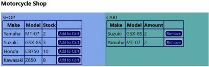

## React Shopping Cart First Step 

Just an exercise I did as a first step in creating a shopping cart

### Installation

#### 1.

First you will need to setup Strapi with a Collection "motorcycles" (singular motorcycle).
Entries will need the following fields:

- make (text short)
- model (text short)
- stock (int)

Once you can hit http://localhost:1337/api/motorcycles and get the information (example below) you can proceed with the next step

{"data":[{"id":1,"attributes":{"make":"Yamaha","model":"MT-07","stock":4,"createdAt":"2023-01-31T16:04:12.682Z","updatedAt":"2023-02-02T17:28:49.731Z","publishedAt":"2023-01-31T16:04:20.470Z"}},{"id":2,"attributes":{"make":"Suzuki","model":"GSX-8S","stock":5,"createdAt":"2023-01-31T16:05:45.793Z","updatedAt":"2023-01-31T16:05:46.442Z","publishedAt":"2023-01-31T16:05:46.439Z"}},{"id":3,"attributes":{"make":"Honda","model":"CB750","stock":10,"createdAt":"2023-01-31T16:09:14.690Z","updatedAt":"2023-01-31T16:15:52.587Z","publishedAt":"2023-01-31T16:09:15.242Z"}},{"id":4,"attributes":{"make":"Kawasaki","model":"Z650","stock":8,"createdAt":"2023-01-31T16:10:16.497Z","updatedAt":"2023-01-31T16:10:16.984Z","publishedAt":"2023-01-31T16:10:16.983Z"}}],"meta":{"pagination":{"page":1,"pageSize":25,"pageCount":1,"total":4}}}

#### 2.

Start a React app using **npx create-react-app cart**
Install Axios **npm install axios***

Go to your /src folder and copy/overwrite with the files in this Repositorie

It should (I hope) work